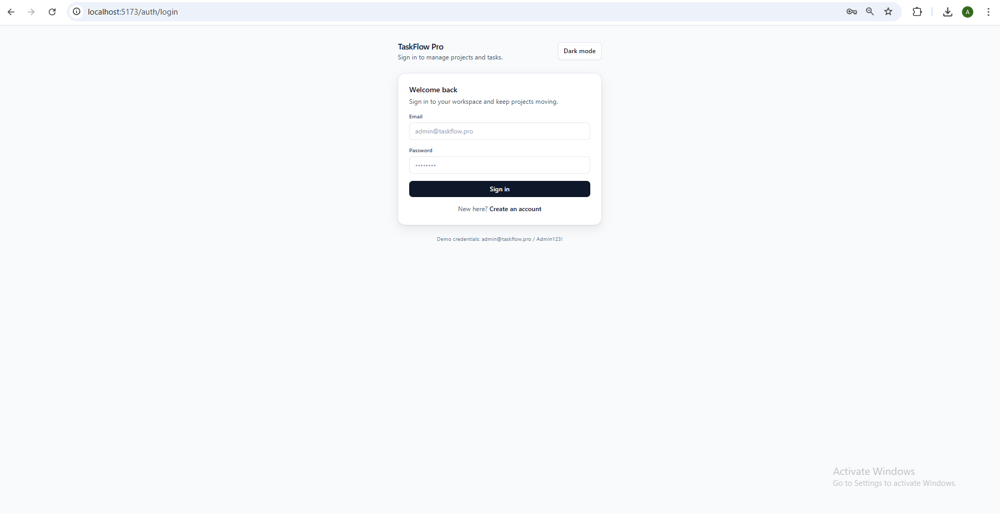
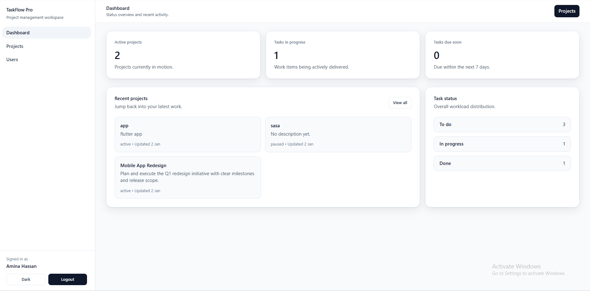
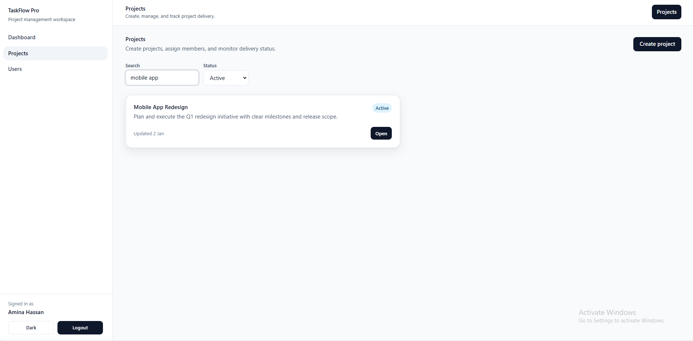
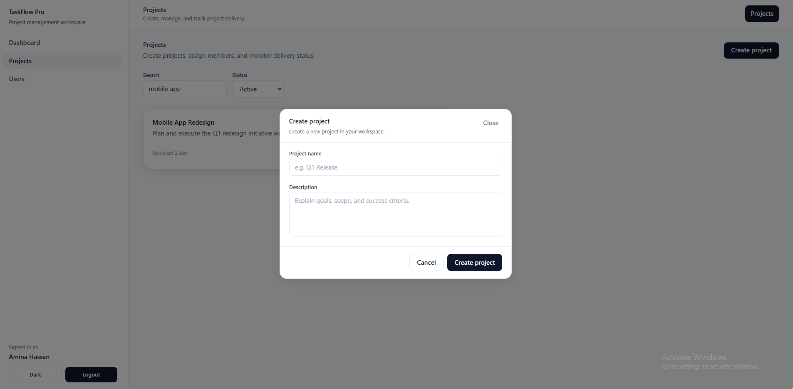
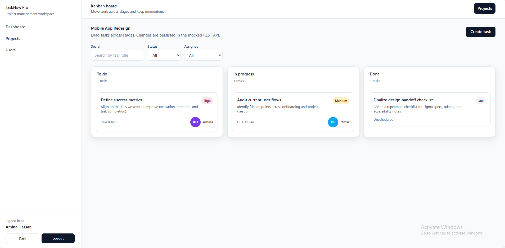
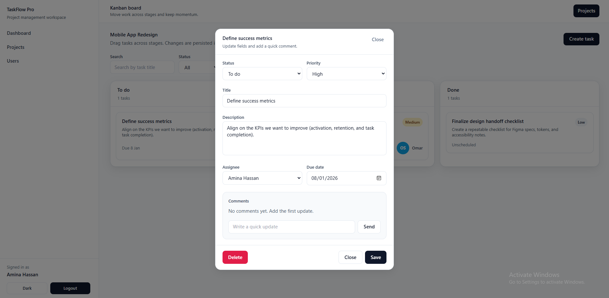
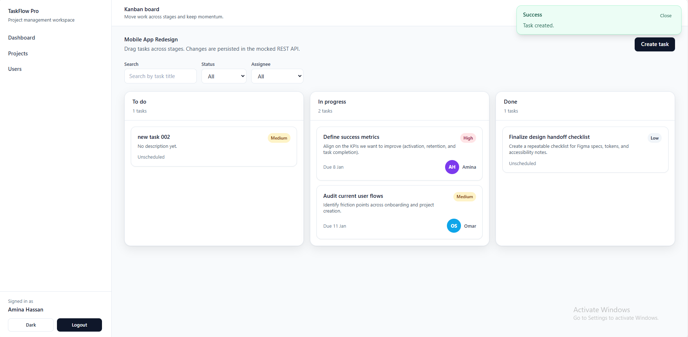
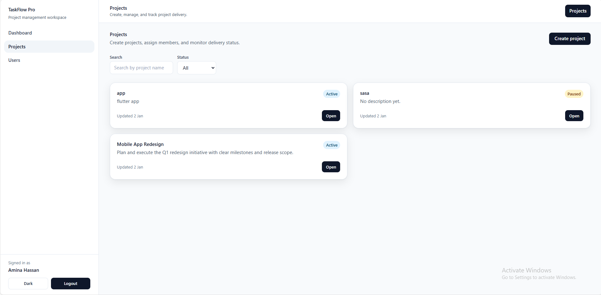

# 🚀 TaskFlow Pro


**TaskFlow Pro** is a production-style **project management SaaS frontend** built with **Vue 3 + TypeScript**.  
It demonstrates how I design, structure, and ship **real-world frontend applications**: feature-first architecture, clear state boundaries, role-based access control (RBAC), and predictable UX—even under failure.

The app runs fully client-side using a **mocked REST API persisted in `localStorage`**, making it portable and easy to run without backend setup.

**Author:** Ahmad  
GitHub: **@Siggmond**

---

## ✨ Highlights

- 🗂 **Projects & Tasks (Kanban)**
  - Project creation and management
  - Drag & drop Kanban workflow
  - Task priority, due date, assignee, and status
- 🔐 **Role-Based Access Control (RBAC)**
  - Admin / Member roles
  - Permissions enforced in both **store** and **UI**
- 🧾 **Activity Log**
  - Project-level audit trail (high-signal actions only)
- 🔎 **Search & Filters**
  - Projects and tasks with debounced inputs
- 🚨 **Global Error Handling**
  - Centralized error normalization
  - Toast notifications (no silent failures)
- 💾 **Persistent Mock API**
  - CRUD flows with data persisted across refreshes

---

## 🧠 Tech Stack

- **Vue 3** (Composition API)
- **TypeScript**
- **Pinia**
- **Vue Router**
- **Vite**
- **Tailwind CSS**
- **Axios**
- **Mock REST API** (Axios adapter + `localStorage`)

---

## 🏗 Architecture (High Level)

This project is structured like a real product—not a demo.

- **Feature-first modules** (`src/modules/*`)
- **Store / Service split**
  - Stores manage state & orchestration
  - Services are the only API boundary
- **Single API surface**
  - Centralized HTTP client with normalized errors
- **Defensive UX**
  - Unexpected runtime or API issues are surfaced clearly

> The goal is maintainability, predictability, and clarity—not shortcuts.

---

## 📁 Folder Structure (Simplified)

```text
src/
├─ api/         # HTTP client + mock backend
├─ modules/     # Feature domains (auth, projects, tasks, users)
├─ store/       # Global stores (toasts, shared state)
├─ components/  # Reusable UI primitives
├─ router/      # Routes + auth guards
```

---

## 📸 Preview / Screenshots

### Authentication & Theme


### Workspace & Projects




### Kanban & Tasks



### Activity & Admin




---

## ▶️ Getting Started

### Requirements
- **Node.js 18+** (tested with Node 20)

```bash
npm install
npm run dev
```

Vite will print the local URL (usually `http://localhost:5173`).

---

## 👤 Demo Accounts

| Role   | Email               | Password    |
|--------|---------------------|-------------|
| Admin  | admin@taskflow.pro  | Admin123!   |
| Member | member@taskflow.pro | Member123!  |

---

## 🔮 Possible Next Steps

- Real backend integration (JWT + database)
- File attachments
- Notifications (in-app / email)

---

## 📜 License

MIT

---

> If you like this project, feel free to explore the codebase, fork it, or adapt the architecture for your own work 🔥
