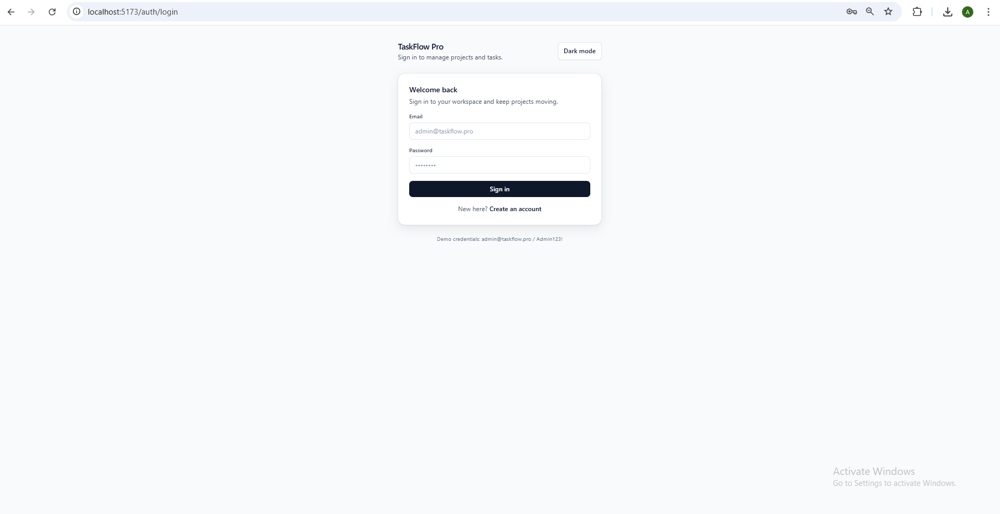
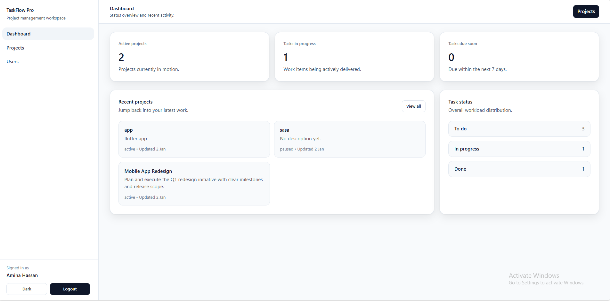
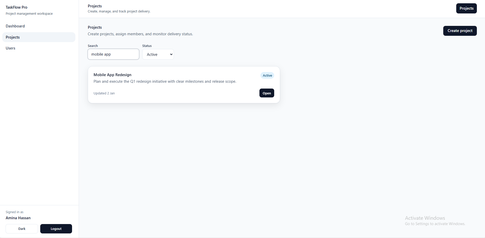
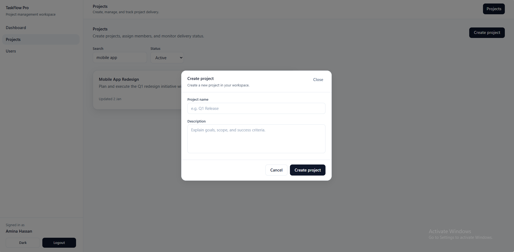
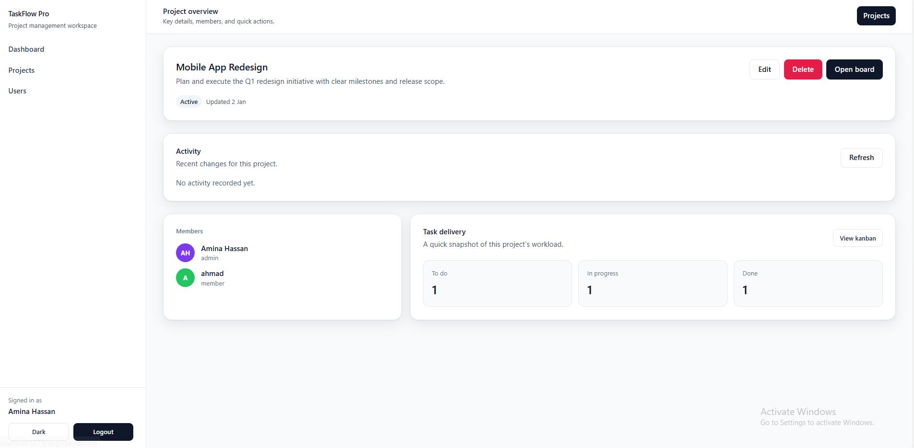
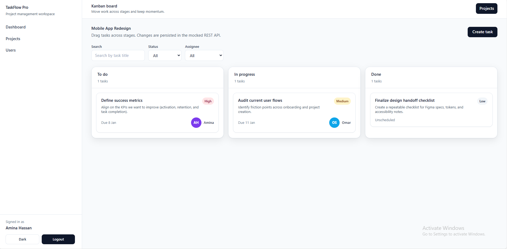
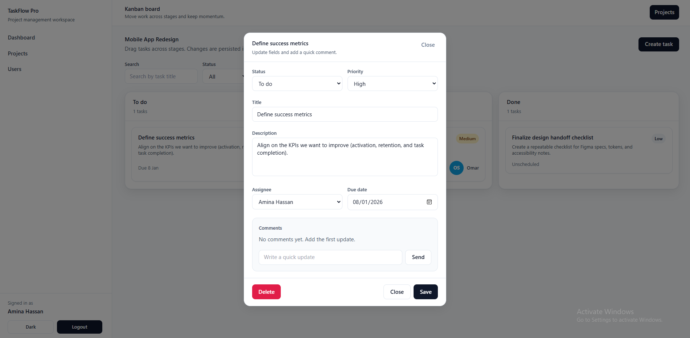
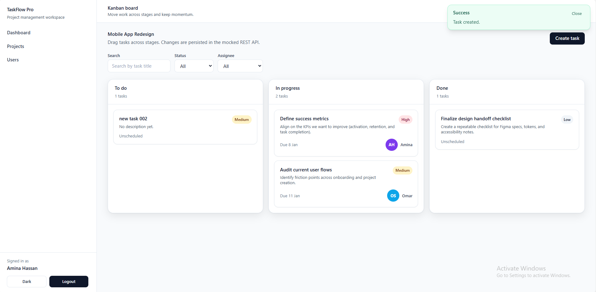
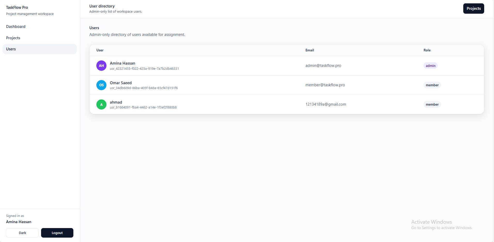
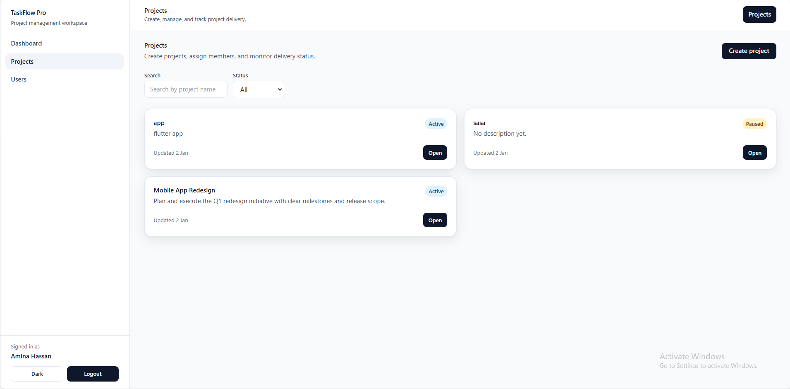

# TaskFlow Pro


**TaskFlow Pro** is a frontend-focused project management SaaS portfolio project built with **Vue 3 + TypeScript**. It shows production-style frontend architecture, realistic project/task workflows, Pinia state boundaries, route guards, RBAC-driven UI, and centralized API/error handling.

The app runs fully client-side for easy review. It uses a mocked REST API with `localStorage` persistence, so it is not a full production SaaS platform and is not backed by a real server or database.

**Author:** Ahmad  
GitHub: **@Siggmond**

---

## Quick Reviewer Path

If you have 5 minutes, review the project in this order:

1. **Understand the product:** TaskFlow Pro is a Vue 3 project management frontend with auth, projects, Kanban tasks, activity history, admin/member roles, search/filter UX, and persistent mock data.
2. **Run it locally:**

   ```bash
   npm install
   npm run dev
   ```

   Vite prints the local URL, usually `http://localhost:5173`.

3. **Use the demo accounts:**

   | Role | Email | Password |
   | ---- | ----- | -------- |
   | Admin | `admin@taskflow.pro` | `Admin123!` |
   | Member | `member@taskflow.pro` | `Member123!` |

4. **Inspect the main architecture first:**

   | Area | Start here | What to look for |
   | ---- | ---------- | ---------------- |
   | App bootstrap | `src/main.ts` | Pinia setup, global error handling, mock API install, auth hydration |
   | Routing | `src/router/index.ts` | Auth guard and admin-only route metadata |
   | Auth/RBAC | `src/modules/auth/store.ts`, `src/modules/auth/permissions.ts` | Session state, role permissions, store-level permission assertions |
   | Projects | `src/modules/projects/` | Feature-first views, store/service split, project CRUD |
   | Tasks/Kanban | `src/modules/tasks/` | Kanban board, task forms/details, optimistic move behavior |
   | Mock REST API | `src/api/http.ts`, `src/api/mock/` | Axios request wrapper, normalized errors, in-browser adapter, `localStorage` persistence |
   | Shared state/UI | `src/store/`, `src/components/` | Toast/theme stores and reusable UI primitives |

5. **Use screenshots as proof of coverage:** the screenshots in `docs/screenshots/` show login, dashboard shell, project list filtering, create/edit flows, Kanban task movement, task details, activity log, admin user directory, and member RBAC constraints.
6. **Separate real architecture from mocked backend behavior:** the frontend architecture, routing, stores, UI permissions, error handling, and UX flows are real. The backend is intentionally mocked in-browser through an Axios adapter and `localStorage`, so persistence and authorization are demonstration-oriented.

---

## What This Project Proves

- Vue 3 Composition API architecture with feature-first modules.
- Strict TypeScript configuration across Vue and TypeScript files.
- Pinia store boundaries for auth, projects, tasks, users, activity, toasts, and theme.
- Vue Router route guards for authenticated areas and admin-only routes.
- Project, task, and Kanban workflow UX with task details, assignees, priorities, due dates, and drag-and-drop status changes.
- RBAC enforced in both UI visibility and store actions through shared permission helpers.
- Mocked REST API behavior using Axios and an adapter-backed `localStorage` database.
- Centralized API request handling with retries, normalized errors, unauthorized handling, app-level error capture, and toast feedback.
- Debounced search/filter UX in the projects list and Kanban board.
- Maintainable SPA structure with a clear split between views, components, stores, services, types, utilities, and API infrastructure.

---

## Demo Mode / Local Run

### Requirements

- Node.js 18+.

### Install and start

```bash
npm install
npm run dev
```

### Demo accounts

| Role | Email | Password | Notes |
| ---- | ----- | -------- | ----- |
| Admin | `admin@taskflow.pro` | `Admin123!` | Can create/update/delete projects and access the user directory. |
| Member | `member@taskflow.pro` | `Member123!` | Can work with assigned project tasks but does not see admin-only project/user controls. |

Demo data is seeded by the mock database and persisted in browser storage. To reset the demo state, clear the browser's local storage for the app.

---

## Tech Stack

- **Vue 3** with Composition API
- **TypeScript** with strict compiler settings
- **Pinia** for state management
- **Vue Router** for authenticated app routing and guards
- **Vite** for local development and builds
- **Tailwind CSS** for styling
- **Axios** for the API surface
- **vuedraggable** for Kanban drag-and-drop
- **Mock REST API** using an Axios adapter and `localStorage`

---

## Architecture Map

```text
src/
|-- api/              # Axios client, request wrapper, mock REST adapter, localStorage-backed mock DB
|-- components/       # Reusable UI primitives
|-- layouts/          # Auth and dashboard layout shells
|-- modules/
|   |-- auth/         # Login/register service, auth store, RBAC permission helpers
|   |-- dashboard/    # Dashboard overview
|   |-- projects/     # Project views, cards, forms, store, service, activity store/service
|   |-- tasks/        # Kanban view, task cards/modals, task store/service
|   |-- users/        # Admin user directory store/service/view
|   `-- system/       # Not-found view
|-- router/           # Vue Router routes and guards
|-- store/            # Global toast and theme stores
|-- styles/           # Tailwind entrypoint
|-- types/            # Shared domain/API types
`-- utils/            # Storage, ID, debounce helpers
```

The project follows a feature-first shape: each major domain keeps its views, store, and service near each other, while shared infrastructure stays in `src/api`, `src/store`, `src/components`, and `src/types`.

---

## Screenshots

These screenshot paths exist in `docs/screenshots/` and are included to show specific implemented flows rather than decorative mockups.

| Screenshot | What it proves |
| ---------- | -------------- |
|  | Auth entry point, themed UI, demo-friendly login flow. |
|  | Authenticated app shell, navigation, dashboard layout, and summary-oriented workspace view. |
|  | Project listing, status filter, debounced project search, and permission-aware create action. |
|  | Modal form pattern, project creation workflow, and reusable inputs/buttons. |
|  | Project detail page with project metadata, related task context, and activity access. |
|  | Task columns, drag-and-drop workflow, filters, assignees, and persisted status updates. |
|  | Task edit/details flow, comments, metadata, and member assignment UI. |
|  | Project-level activity trail produced by key project/task actions. |
|  | Admin-only users route and role-aware navigation. |
|  | Member experience with restricted admin/project controls hidden from the UI. |

---

## Current Scope / Honest Limitations

- The backend is mocked in-browser; there is no real server process.
- Data persists through `localStorage`, not a database.
- Auth tokens and RBAC are demonstration-oriented and must not be treated as production security.
- The mock API performs useful frontend validation and access checks, but real production use would require server-side authorization and trusted backend enforcement.
- Production use would need real backend APIs, a database, deployment infrastructure, observability, audit/security hardening, and a fuller test/CI strategy.

---

## Package Scripts

```bash
npm run dev        # Start Vite locally
npm run build      # Type-check and build production assets
npm run typecheck  # Run vue-tsc without emitting files
npm run lint       # Run ESLint
npm run preview    # Preview the built app
```

There is no `npm test` script in the current `package.json`.

---

## Possible Next Steps

- Replace the mock API with real backend endpoints and server-side authorization.
- Add a database-backed project/task model.
- Add tests and CI coverage around stores, route guards, permissions, and critical UI flows.
- Add file attachments and notifications.

---

## License

MIT
